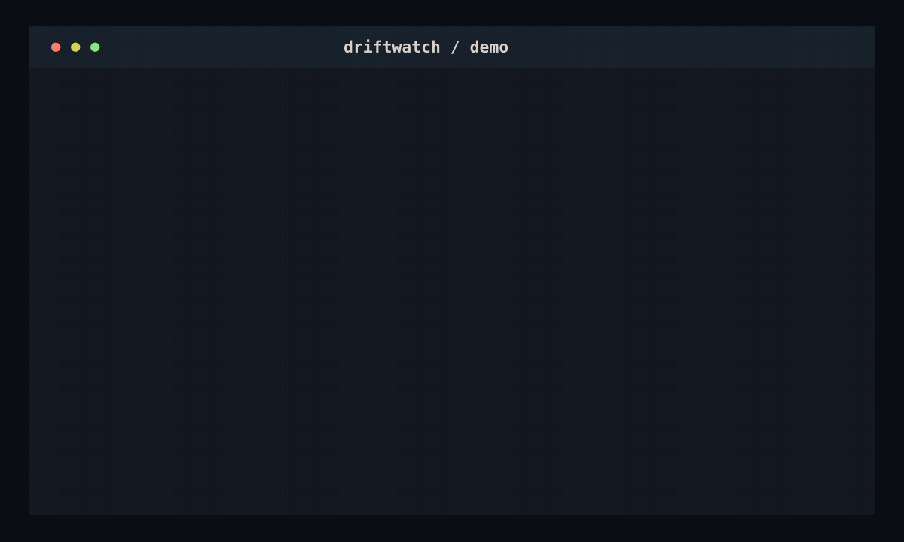

# Driftwatch

Driftwatch detects when implementation quietly diverges from a product requirements document. It turns testable PRD assertions into tracked claims and reports violations with file-and-line evidence.



> **Status:** The four-command v1 flow and live-validated demo are implemented. npm publication and final challenge submission assets remain.

## Requirements

- Node.js 20 or newer
- Git
- `rg` (ripgrep)
- An installed and authenticated Codex CLI available as `codex` on `PATH`

The ChatGPT desktop app bundles Codex on macOS. If `codex --version` is not found, expose that binary for the current shell:

```sh
export PATH="/Applications/ChatGPT.app/Contents/Resources:$PATH"
codex --version
```

## Install

After npm publication, run the CLI without a global installation:

```sh
npx driftwatch --help
```

From a repository checkout, install dependencies and compile the same package locally:

```sh
npm install
npm run build
node dist/cli.js --help
```

## Development

```sh
npm install
npm run build
npm test
```

## Test in 2 Commands

From a fresh repository checkout, install dependencies and run the bundled fixture without a build step:

```sh
npm install
npm run dev -- ingest demo/PRD.md && npm run dev -- report
```

The expected summary is `3 violated · 0 unimplemented · 3 satisfied`. `report` exits with code `1` because the violations are intentional, and it stores the same output at `.driftwatch/DRIFT.md`.

Run the CLI from source:

```sh
npm run dev -- init
npm run dev -- ingest driftwatch-prd.md
npm run dev -- check
npm run dev -- report
```

`init` creates `.driftwatch/config.json` and `.driftwatch/state.json` at the Git repository root. `ingest` extracts claims, ranks up to three candidate files per claim with ripgrep, verifies them through the local Codex CLI, and writes `claims.json` plus `mapping.json`. `check` re-verifies only claims affected since the stored baseline commit and retries previously unmapped claims against changed files. `report` performs no inference; it prints the stored status and writes identical Markdown to `.driftwatch/DRIFT.md`. Generated state is human-readable and intended to be committed.

## Commands

The v1 interface contains exactly four commands:

- `driftwatch init`
- `driftwatch ingest <path-to-prd.md>`
- `driftwatch check`
- `driftwatch report`

See `driftwatch-prd.md` for the complete product contract and numbered acceptance requirements.

## Built with Codex

Driftwatch was designed and implemented through Codex sessions using GPT-5.6 Sol. Codex was used for repository scaffolding, implementation, tests, candidate-ranking diagnosis, and live end-to-end verification against the bundled demo; the resulting state and report are committed for review.
